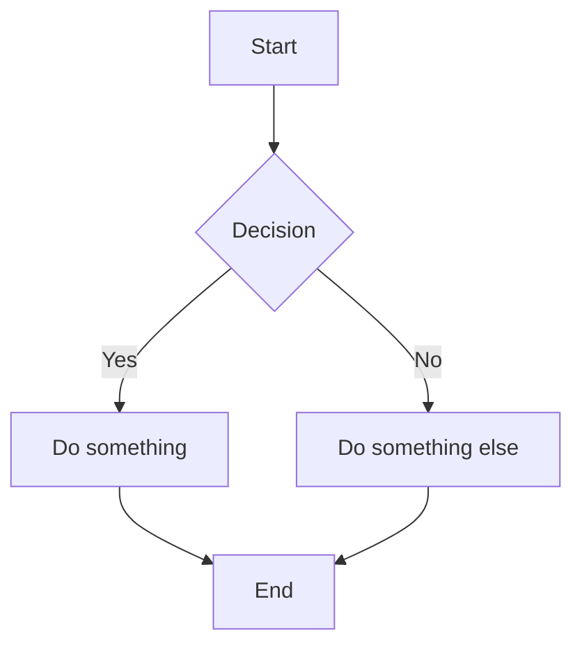
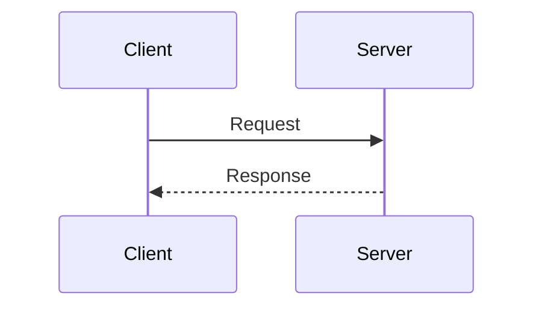

# MDX Features Reference

Complete guide to MDX features in Docusaurus.

## Table of Contents
- [Admonitions](#admonitions)
- [Tabs](#tabs)
- [Code Blocks](#code-blocks)
- [Collapsible Sections](#collapsible-sections)
- [Tables](#tables)
- [Images](#images)
- [Links](#links)
- [Components](#components)
- [Math Equations](#math-equations)
- [Diagrams](#diagrams)

---

## Admonitions

### Basic Admonitions
```markdown
:::note
Highlights information users should take into account.
:::

:::tip
Optional information to help users be more successful.
:::

:::info
Information that users should be aware of.
:::

:::warning
Critical content requiring user attention due to potential risks.
:::

:::danger
Negative potential consequences of an action.
:::
```

### Custom Titles
```markdown
:::tip[My Custom Title]
Content with a custom admonition title.
:::

:::danger[Don't Do This]
Explains what not to do.
:::
```

### Nested Content
```markdown
:::note

Admonitions can contain:

- **Bold** and *italic* text
- [Links](https://example.com)
- `inline code`

```javascript
// Code blocks
const x = 1;
```

Even nested admonitions:

:::tip
Nested tip inside note!
:::

:::
```

---

## Tabs

### Basic Tabs
```mdx
import Tabs from '@theme/Tabs';
import TabItem from '@theme/TabItem';

<Tabs>
  <TabItem value="js" label="JavaScript" default>
    ```js
    console.log('Hello, JavaScript!');
    ```
  </TabItem>
  <TabItem value="py" label="Python">
    ```python
    print('Hello, Python!')
    ```
  </TabItem>
  <TabItem value="go" label="Go">
    ```go
    fmt.Println("Hello, Go!")
    ```
  </TabItem>
</Tabs>
```

### Synced Tabs (Persist Selection)
```mdx
<Tabs groupId="package-manager">
  <TabItem value="npm" label="npm">
    ```bash
    npm install docusaurus
    ```
  </TabItem>
  <TabItem value="yarn" label="Yarn">
    ```bash
    yarn add docusaurus
    ```
  </TabItem>
  <TabItem value="pnpm" label="pnpm">
    ```bash
    pnpm add docusaurus
    ```
  </TabItem>
</Tabs>

{/* Later in the same page or other pages */}
<Tabs groupId="package-manager">
  <TabItem value="npm" label="npm">
    ```bash
    npm run build
    ```
  </TabItem>
  <TabItem value="yarn" label="Yarn">
    ```bash
    yarn build
    ```
  </TabItem>
</Tabs>
```

### Query String Tabs
```mdx
<Tabs queryString="platform">
  <TabItem value="ios" label="iOS">
    iOS instructions...
  </TabItem>
  <TabItem value="android" label="Android">
    Android instructions...
  </TabItem>
</Tabs>
```
URL becomes: `?platform=ios`

---

## Code Blocks

### Basic with Language
````markdown
```javascript
const greeting = 'Hello, World!';
console.log(greeting);
```
````

### With Title
````markdown
```javascript title="src/components/Hello.js"
export const Hello = () => <h1>Hello!</h1>;
```
````

### Line Highlighting
````markdown
```javascript {2,5-7}
function example() {
  const highlighted = true;  // Line 2 highlighted
  const normal = false;

  return {                   // Lines 5-7 highlighted
    highlighted,
    normal,
  };
}
```
````

### Line Numbers
````markdown
```javascript showLineNumbers
const line1 = 'first';
const line2 = 'second';
const line3 = 'third';
```
````

### Start from Specific Line
````markdown
```javascript showLineNumbers {1} title="Starting at line 42"
// This line is 42
const answer = 42;
```
````

### Magic Comments
````markdown
```javascript
function App() {
  // highlight-next-line
  const important = true;

  // highlight-start
  const alsoImportant = {
    multi: 'line',
    highlight: true,
  };
  // highlight-end

  return <div>{important}</div>;
}
```
````

### Live Code Editor (if enabled)
````markdown
```jsx live
function Clock() {
  const [date, setDate] = useState(new Date());

  useEffect(() => {
    const timer = setInterval(() => setDate(new Date()), 1000);
    return () => clearInterval(timer);
  }, []);

  return <div>{date.toLocaleTimeString()}</div>;
}
```
````

### npm2yarn (Auto-convert npm commands)
````markdown
```bash npm2yarn
npm install @docusaurus/core
```
````

---

## Collapsible Sections

### Basic Details
```markdown
<details>
  <summary>Click to expand</summary>

  This content is hidden by default.

  - Supports **markdown**
  - And lists
  - And more

</details>
```

### Default Open
```markdown
<details open>
  <summary>Expanded by default</summary>

  This is visible immediately.

</details>
```

### Nested Details
```markdown
<details>
  <summary>Level 1</summary>

  <details>
    <summary>Level 2</summary>

    Nested content here.

  </details>

</details>
```

---

## Tables

### Basic Table
```markdown
| Feature | Status | Notes |
|---------|--------|-------|
| Dark mode | ✅ | Enabled |
| Search | ✅ | Algolia |
| i18n | ❌ | Planned |
```

### Aligned Columns
```markdown
| Left | Center | Right |
|:-----|:------:|------:|
| L1   | C1     | R1    |
| L2   | C2     | R2    |
```

---

## Images

### Basic Markdown
```markdown

```

### With Caption
```markdown

*Figure 1: The main dashboard*
```

### Sized Image (JSX)
```mdx

```

### From Static Folder
```markdown

```

### Themed Images
```mdx
import ThemedImage from '@theme/ThemedImage';

<ThemedImage
  alt="Logo"
  sources={{
    light: '/img/logo-light.png',
    dark: '/img/logo-dark.png',
  }}
/>
```

### Ideal Image (Optimized)
```mdx
import Image from '@theme/IdealImage';

<Image img={require('./img/large-image.png')} />
```

---

## Links

### Internal Doc Links
```markdown
[Getting Started](./getting-started.md)
[API Reference](../api/overview.md)
[Absolute path](/docs/intro)
```

### Heading Anchors
```markdown
[Jump to section](#section-heading)
[Section in another doc](./other-doc.md#specific-section)
```

### File Downloads
```markdown
[Download PDF](/files/guide.pdf)
```

### Reference-style Links
```markdown
Check the [API docs][api] for more info.

[api]: ./api/overview.md
```

---

## Components

### Import Custom Components
```mdx
import CustomButton from '@site/src/components/CustomButton';
import {FeatureList} from '@site/src/components/Features';

<CustomButton href="/docs/intro">Get Started</CustomButton>

<FeatureList />
```

### Inline JSX
```mdx
The answer is <code>{40 + 2}</code>.

<div style={{
  backgroundColor: 'var(--ifm-color-primary)',
  padding: '1rem',
  borderRadius: '8px',
  color: 'white'
}}>
  Styled container
</div>
```

### Partial Imports (Reusable Content)
```mdx
import PartialContent from './_partials/common-warning.md';

<PartialContent />
```

---

## Math Equations

Requires `remark-math` and `rehype-katex` plugins.

### Inline Math
```markdown
The equation $E = mc^2$ changed physics.
```

### Block Math
```markdown
$$
\sum_{i=1}^{n} x_i = x_1 + x_2 + \cdots + x_n
$$
```

---

## Diagrams

Requires Mermaid plugin (`@docusaurus/theme-mermaid`).

### Flowchart
````markdown

````

### Sequence Diagram
````markdown

````
